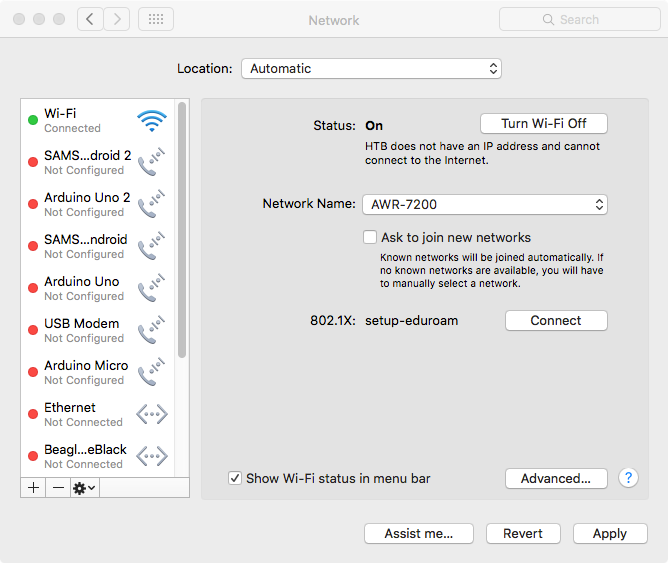
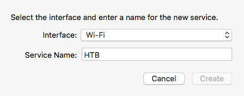
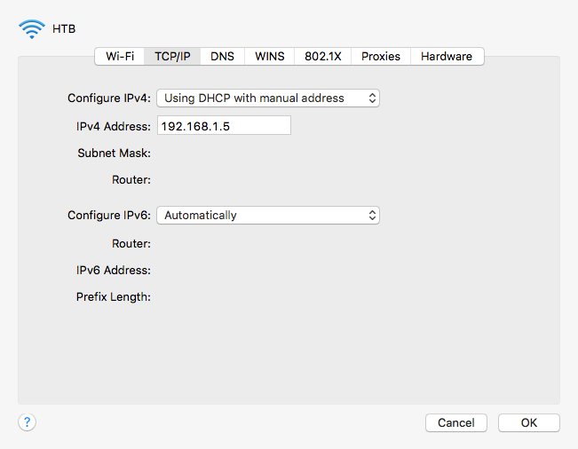

# hacking-the-body
Wearable technology project for live-coding choreography

###Dependencies

* [mosquitto](http://mosquitto.org/) (v1.4.5)
* [Processing](https://processing.org/) (v3.0.1)
* [MQTT for Processing](https://github.com/256dpi/processing-mqtt) (v1.6.0)
* [ControlP5 for Processing](http://www.sojamo.de/libraries/controlP5/) (v.2.2.5)

###Setting Up the System

1. Plug in the wifi router.
2. Connect to the router on the computer hosting the broker (called AWR-7200 for Hacking the Body).

####Setting up the network for the first time

1. If this is the first time connecting to the router, set up a static IP address for this network. On a Mac, go to Network Preferences.
2. Click on the '+' to add a new interface.

3. Create a new interface using Wifi and give it a name then click 'create'.

4. Click on 'Advanced...' and then the 'TCP/IP' tab. Select 'Using DHCP with manual address' from the 'Configure IPv4:' menu. Enter type 192.168.1.5 in the 'IPv4 Address:' text box. Click 'OK'. 

5. Click 'Apply' and close Network Preferences.

###Starting the Software
1. Start the mosquitto broker. For an install on a Mac using homebrew, type the following in the terminal (without the quotes) '/usr/local/sbin/mosquitto'.
2. Open the Processing sketch in Processing.
3. Start running the Processing sketch. Check that there were no errors in connecting to the broker in the Processing console.